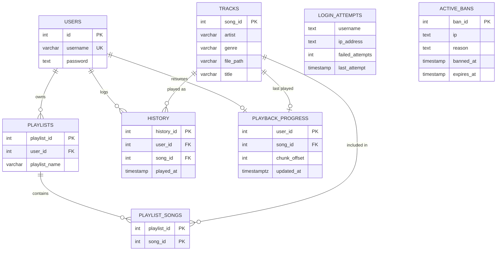

```
██████╗ ███████╗██╗  ████████╗ █████╗ ██████╗ ██╗      █████╗ ██╗   ██╗
██╔══██╗██╔════╝██║  ╚══██╔══╝██╔══██╗██╔══██╗██║     ██╔══██╗╚██╗ ██╔╝
██║  ██║█████╗  ██║     ██║   ███████║██████╔╝██║     ███████║ ╚████╔╝
██║  ██║██╔══╝  ██║     ██║   ██╔══██║██╔═══╝ ██║     ██╔══██║  ╚██╔╝
██████╔╝███████╗███████╗██║   ██║  ██║██║     ███████╗██║  ██║   ██║
╚═════╝ ╚══════╝╚══════╝╚═╝   ╚═╝  ╚═╝╚═╝     ╚══════╝╚═╝  ╚═╝   ╚═╝

                Music Streaming Platform for SysADs
```

<div align="center">


</div>

> A secure application that streams music over **TCP**, with all connections encrypted using **TLS** and **JWT-based authentication** securing every client request. It features adaptive **FFmpeg** transcoding with heartbeat-driven network quality monitoring, **Semaphore-based** scheduling to limit concurrent transcoding tasks, cached transcoded audio with **automatic cache cleanup**, and **seamless client reconnection**. The application also integrates **yt-dlp** for automated YouTube audio downloads, performs filename and metadata sanitization, applies download rate limiting, and provides real-time music **library synchronization** across all connected clients.
 

---

## Features

- **Secure transport** — Every connection is protected using **TLS** (`ssl.SSLContext`), with `CERT_NONE` on the client for self-signed certificates. A custom framed protocol (**1-byte message type + 4-byte payload length**) multiplexes JSON control messages and raw audio chunks over a single TCP connection.

- **Authentication & session management** — User credentials are secured with **bcrypt** hashing, while **JWT (HS256)** tokens authenticate every client request. Persistent sessions and a **RECONNECT** flow allow interrupted streams to resume from the exact playback position without restarting the track.

- **IP based rate limiting** : Server rate limits the connection from the same IP for a particular time window. If exceeded the IP will be banned.

- **Brute-force protection**  Failed login attempts are tracked per IP address. Clients exceeding the configured threshold are automatically banned and rejected during the TLS handshake on subsequent connection attempts.

- **Adaptive bitrate streaming** — Periodic **PING/PONG heartbeats** measure network latency in real time, allowing the server to dynamically transcode audio using **FFmpeg** (128 kbps, 64 kbps, or passthrough) to match connection quality.

- **Semaphore-based transcoding scheduler** : Concurrent **FFmpeg** transcoding jobs are controlled using a **Semaphore**, preventing excessive CPU utilization while serving multiple clients.

- **Transcode caching with automatic eviction** : Transcoded audio is cached on disk and indexed by **(song, bitrate)**. Cached files are shared across clients and automatically removed after a configurable idle timeout, while files currently being streamed are protected from eviction.

- **Resume playback** : The server persists the user's actual listened playback position (rather than bytes transmitted) and offers to continue playback from the saved timestamp during the next login.

- **Dynamic library synchronization** : A background scanner continuously monitors the music directory, detects newly added, modified, or deleted files, extracts metadata, updates the database, and broadcasts live library updates to all connected clients without requiring a restart.

- **Playlist management** : Users can create, delete, list, load, and modify playlists, with all playlist data stored persistently on the server.

- **YouTube downloads** : Clients submit a text file containing YouTube links. The server downloads audio using **yt-dlp**, converts it to MP3, performs strict filename and metadata sanitization, applies **rate limiting** to download requests, and automatically adds the tracks to the music library.

- **Listening history** : Every playback event is recorded with a timestamp for each user, enabling persistent listening history.

- **Automatic backups** : A background task periodically executes **`pg_dump`** to create database backups for disaster recovery.

## Database Schema 




## Client commands

| Command | Description |
|---|---|
| `list` | Show the currently loaded song list |
| `library` | Re-fetch the full catalog from the server |
| `play <index>` | Stream a song by its index in `list` |
| `pause` / `resume` | Pause / unpause the current stream |
| `continue` | Resume the song you were listening to last session, from where you actually left off |
| `stop` | Stop playback |
| `status` | Show now-playing, round-trip time, and buffer health |
| `playlists` | List your saved playlists |
| `create_playlist <name> [i1,i2,...]` | Create a playlist, optionally seeded with song indices |
| `load_playlist <index>` | Load a playlist's tracks into the current song list |
| `delete_playlist <index>` | Delete a playlist |
| `add_to_playlist <playlist_index> <song_index>` | Add a song to an existing playlist |
| `download <path>` | Send a text file of YouTube links to the server for downloading |
| `history` | Show your listening history |
| `help` | Show the command list |
| `quit` / `exit` | Disconnect |
